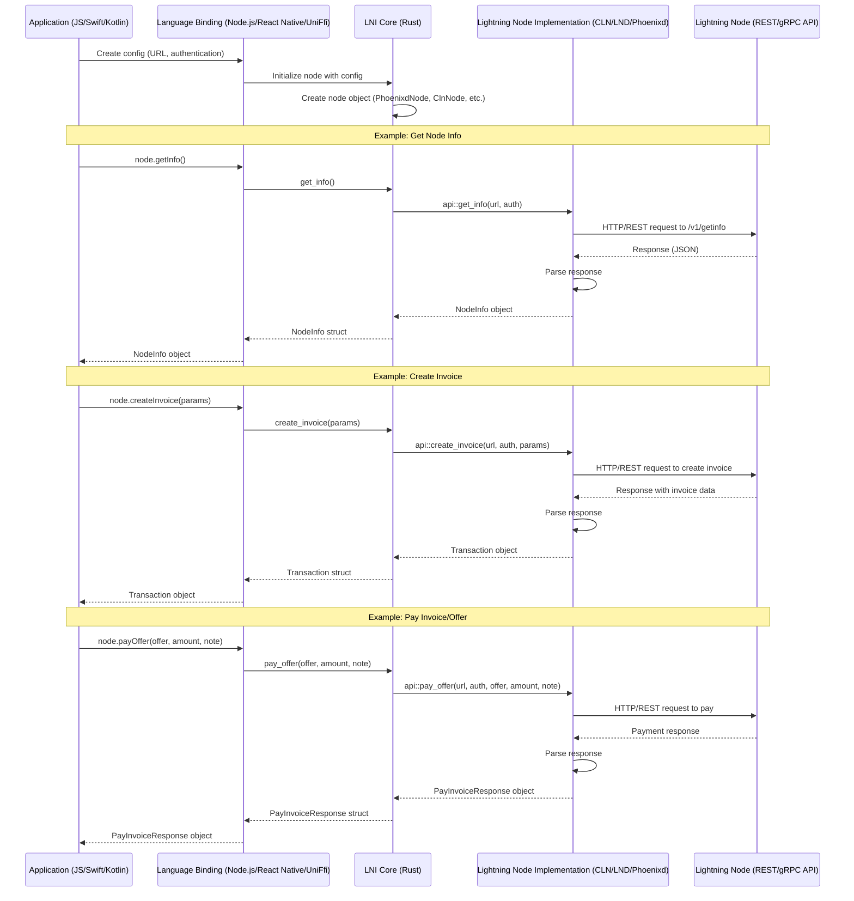

LNI Remote - Lightning Node Interface Remote
============================================

Remote connect to all the major lightning node implementations with a standard interface. 

- Supports all major nodes - CLN, LND, Phoenixd, *LNDK (WIP) 
- Supports the main protocols - BOLT 11, BOLT 12, and NWC
- Also popular REST APIs (Custodial) - Strike, Speed, Blink
- Language Binding support for kotlin, swift, react-native, nodejs (typescript/javascript). No support for WASM (yet)
- Tor support
- Runs on Android, iOS, Linux, Windows and Mac


### Interface API Examples

#### Rust
```rust
let lnd_node = LndNode::new(LndConfig { url, macaroon });
let cln_node = ClnNode::new(ClnConfig { url, rune });

let lnd_node_info = lnd_node.get_info();
let cln_node_info = cln_node.get_info();

let invoice_params = CreateInvoiceParams {
    invoice_type: InvoiceType::Bolt11,
    amount_msats: Some(2000),
    description: Some("your memo"),
    expiry: Some(1743355716),
    ..Default::default()
});

let lnd_invoice = lnd_node.create_invoice(invoice_params).await;
let cln_invoice = cln_node.create_invoice(invoice_params).await;

let pay_invoice_params = PayInvoiceParams{
    invoice: "{lnbc1***}", // BOLT 11 payment request
    fee_limit_percentage: Some(1.0), // 1% fee limit
    allow_self_payment: Some(true), // This setting works with LND, but is simply ignored for CLN etc...
    ..Default::default(),
});

let lnd_pay_invoice = lnd_node.pay_invoice(pay_invoice_params);
let cln_pay_invoice = cln_node.pay_invoice(pay_invoice_params);

let lnd_invoice_status = lnd_node.lookup_invoice("{PAYMENT_HASH}");
let cln_invoice_status = cln_node.lookup_invoice("{PAYMENT_HASH}");

let list_txn_params = ListTransactionsParams {
    from: 0,
    limit: 10,
    payment_hash: None, // Optionally pass in the payment hash, or None to search all
};

let lnd_txns = lnd_node.list_transactions(list_txn_params).await;
let cln_txns = cln_node.list_transactions(list_txn_params).await;

// See the tests for more examples
// LND - https://github.com/lightning-node-interface/lni/blob/master/crates/lni/lnd/lib.rs#L96
// CLN - https://github.com/lightning-node-interface/lni/blob/master/crates/lni/cln/lib.rs#L113
// Phoenixd - https://github.com/lightning-node-interface/lni/blob/master/crates/lni/phoenixd/lib.rs#L100
```

#### Typescript
```typescript
const lndNode = new LndNode({ url, macaroon });
const clnNode = new ClnNode({ url, rune });

const lndNodeInfo = lndNode.getInfo();
const clnNodeInfo = clnNode.getInfo();

const invoiceParams = {
    invoiceType: InvoiceType.Bolt11,
    amountMsats: 2000,
    description: "your memo",
    expiry: 1743355716,
});

const lndInvoice = await lndNode.createInvoice(invoiceParams);
const clnInvoice = await clnNode.createInvoice(invoiceParams);

const payInvoiceParams = {
    invoice: "{lnbc1***}", // BOLT 11 payment request
    feeLimitPercentage: 1, // 1% fee limit
    allowSelfPayment: true, // This setting works with LND, but is simply ignored for CLN etc...
});

const lndPayInvoice = await lndNode.payInvoice(payInvoiceParams);
const clnPayInvoice = await clnNode.payInvoice(payInvoiceParams);

const lndInvoiceStatus = await lndNode.lookupInvoice("{PAYMENT_HASH}");
const clnInvoiceStatus = await clnNode.lookupInvoice("{PAYMENT_HASH}");

const listTxnParams = {
    from: 0,
    limit: 10,
    payment_hash: None, // Optionally pass in the payment hash, or None to search all
};

const lndTxns = await lndNode.listTransactions(listTxnParams);
const clnTxns = await clnNode.listTransactions(listTxnParams);
```


#### Payments
```rust
// BOLT 11
node.create_invoice(CreateInvoiceParams) -> Result<Transaction, ApiError>
node.pay_invoice(PayInvoiceParams) -> Result<PayInvoiceResponse, ApiError>

// BOLT 12
node.create_offer(params: CreateOfferParams)  -> Result<Offer, ApiError> 

node.get_offer(search: Option<String>) -> Result<Offer, ApiError> // return the first offer or by search id
node.pay_offer(offer: String, amount_msats: i64, payer_note: Option<String>) -> Result<PayInvoiceResponse, ApiError> 
node.list_offers(search: Option<String>) -> Result<Vec<Offer>, ApiError>

// Lookup
node.decode(str: String) -> Result<String, ApiError> 
node.lookup_invoice(payment_hash: String) -> Result<Transaction, ApiError>
node.list_transactions(ListTransactionsParams) -> Result<Transaction, ApiError>
```

#### Node Management
```rust
node.get_info() -> Result<NodeInfo, ApiError> // returns NodeInfo and balances
```

#### Channel Management
```rust
// TODO - Not implemented
node.channel_info()
```

#### Event Polling

LNI does some simple event polling over http to get some basic invoice status events. 
Polling is used instead of a heavier grpc/pubsub (for now) to make sure the lib runs cross platform and stays lightweight.

Typescript for react-native
```typescript
await node.onInvoiceEvents(
    // polling params
    {
        paymentHash: TEST_PAYMENT_HASH,
        pollingDelaySec: BigInt(3), // poll every 3 seconds
        maxPollingSec: BigInt(60), // for up to 60 seconds
    },
    // callbacks for each polling round
    // The polling ends if success or maxPollingSec timeout is hit
    {
        success(transaction: Transaction | undefined): void {
            console.log('Received success invoice event:', transaction);
            setResult('Success');
        },
        pending(transaction: Transaction | undefined): void {
            console.log('Received pending event:', transaction);
        },
        failure(transaction: Transaction | undefined): void {
            console.log('Received failure event:', transaction);
        },
    }
);
```

Typescript for nodejs
```typescript
await node.onInvoiceEvents(
    // polling params
    {
        paymentHash: process.env.LND_TEST_PAYMENT_HASH,
        pollingDelaySec: 4,
        maxPollingSec: 60,
    }, 
    // callback for each polling round
    // The polling ends if success or maxPollingSec timeout is hit
    (status, tx) => {
        console.log("Invoice event:", status, tx);
    }
);
```

Rust
```rust
struct OnInvoiceEventCallback {}
impl crate::types::OnInvoiceEventCallback for OnInvoiceEventCallback {
    fn success(&self, transaction: Option<Transaction>) {
        println!("success");
    }
    fn pending(&self, transaction: Option<Transaction>) {
        println!("pending");
    }
    fn failure(&self, transaction: Option<Transaction>) {
        println!("epic fail");
    }
}
let params = crate::types::OnInvoiceEventParams {
    payment_hash: TEST_PAYMENT_HASH.to_string(),
    polling_delay_sec: 3,
    max_polling_sec: 60,
};
let callback = OnInvoiceEventCallback {};
NODE.on_invoice_events(params, Arc::new(callback));
```


Build
=======
```
cd crates/lni
cargo clean
cargo build
cargo test
```

Folder Structure
================
```
lni
├── bindings
│   ├── lni_nodejs
│   ├── lni_react_native
├── crates
│   ├── lni
│       |─── lnd
│       |─── cln
│       |─── phoenixd
│       |─── nwc
│       |─── strike
│       |─── speed
│       |─── blink
```

Example
========
#### react-native
```sh
cd bindings/lni_react_native
cat example/src/App.tsx 
yarn start
```

`*troubleshooting react-natve`: 
- if you get an error like `uniffiEnsureInitialized`, then you might need to kill the app and restart. (ios simulator - double tap home button then swipe away app)
- try updating the pods for ios `cd example/ios && pod install --repo-update && cd ../`
- for ios open the xcode app - lni/bindings/lni_react_native/example/ios/LniExample.xcworkspace
    - Then click the project in the left "LniExample" to select for the context menu
    - In the top click "Product -> Clean build folder" and then build and run
- Lastly uninstalling the app from the mobile device

#### kotlin (android)
```sh
cd bindings/kotlin

# Build Kotlin bindings and Android native libraries
./build.sh --release --android

# Run the example Android app
cd example
./gradlew :app:installDebug

# Or launch emulator first
emulator -avd YOUR_AVD_NAME &
./gradlew :app:installDebug
adb shell am start -n com.lni.example/.MainActivity
```

#### nodejs 
```sh
cd bindings/lni_nodejs
cat main.mjs
yarn
# then open ../../crates/lni/Cargo.toml and comment out #crate-type = ["staticlib"]
yarn build
node main.mjs
```

#### .env
```sh
# These env vars are used for tests

TEST_RECEIVER_OFFER=lnotestoffer***
PHOENIX_MOBILE_OFFER=lnotestoffer***

PHOENIXD_URL=http://localhost:9740
PHOENIXD_PASSWORD=YOUR_HTTP_PASSWORD
PHOENIXD_TEST_PAYMENT_HASH=YOUR_TEST_PAYMENT_HASH

CLN_URL=http://localhost:3010
CLN_RUNE=YOUR_RUNE
CLN_TEST_PAYMENT_HASH=YOUR_HASH
CLN_OFER=lnotestoffer***

LND_URL=""
LND_MACAROON=""
LND_TEST_PAYMENT_HASH=""
LND_TEST_PAYMENT_REQUEST=""

NWC_URI="nostr+walletconnect://*"
NWC_TEST_PAYMENT_HASH=""
NWC_TEST_PAYMENT_REQUEST=""

STRIKE_API_KEY=""
STRIKE_TEST_PAYMENT_HASH=""
STRIKE_TEST_PAYMENT_REQUEST=""

BLINK_API_KEY=""
BLINK_TEST_PAYMENT_HASH=""
BLINK_TEST_PAYMENT_REQUEST=""

SPEED_API_KEY=""
SPEED_TEST_PAYMENT_HASH=""
SPEED_TEST_PAYMENT_REQUEST=""
```

Language Bindings
=================

- ## nodejs 
    - napi_rs
    - https://napi.rs/docs/introduction/simple-package
    - `cd bindings/lni_nodejs && cargo clean && cargo build --release && yarn && yarn build`
    - test `node main.mjs`
    - ### native modules (electron, vercel etc..)
        - if you want to use the native node module (maybe for an electron app) you can reference the file `bindings/lni_nodejs/lni_js.${platform}-${arch}.node`. It would look something like in your project:
            ```typescript
            const path = require("path");
            const os = require("os");
            const platform = os.platform();
            const arch = os.arch();
            const nativeModulePath = path.join(
            __dirname,
            `../../code/lni/bindings/lni_nodejs/lni_js.${platform}-${arch}.node`
            );
            const { PhoenixdNode } = require(nativeModulePath);
            ```
- ## react-native 
    - `uniffi-bindgen-react-native` lib
    - https://jhugman.github.io/uniffi-bindgen-react-native/guides/getting-started.html
    - sample https://github.com/ianthetechie/uniffi-starter  
    - `cd bindings/lni_react_native && ./build.sh`

    **To include it in your react-native project:**
    1. In this project run `cd bindings/lni_react_native && ./build.sh && yarn package --out lni.tgz`
    2. This creates a `lni.tgz`. Copy this to your target React Native project in the root.
    3. Prereq: In the React Native project that you want to include `lni`, make sure the new architecure is enabled. And include `lni` in the podfile
        - android 
        
            `build.gradle`
            ```gradle
            defaultConfig {
                // Explicitly set New Architecture flag
                buildConfigField "boolean", "IS_NEW_ARCHITECTURE_ENABLED", (findProperty("newArchEnabled") ?: "false")
                buildConfigField "boolean", "IS_HERMES_ENABLED", (findProperty("hermesEnabled") ?: "true")
            }
            ```

            `gradle.properties`
            ```
            newArchEnabled=true
            hermesEnabled=true
            ```

            `MainApplication.kt`
            ```kt
            override fun onCreate() {
                super.onCreate()
                SoLoader.init(this, OpenSourceMergedSoMapping)
                if (BuildConfig.IS_NEW_ARCHITECTURE_ENABLED) {
                    // If you opted-in for the New Architecture, we load the native entry point for this app.
                    load(bridgelessEnabled = true)
                }
            }
            ```

        - ios
            
            podfile
            ```
            ENV['RCT_NEW_ARCH_ENABLED'] = '1'


            pod 'lni-react-native', :path => '../node_modules/lni_react_native'

            # Fix for New Architecture - remove compiler overrides that conflict with -index-store-path
            installer.pods_project.targets.each do |target|
                target.build_configurations.each do |config|
                    # Remove custom compiler settings that interfere with New Architecture
                    config.build_settings.delete("CC")
                    config.build_settings.delete("LD")
                    config.build_settings.delete("CXX")
                    config.build_settings.delete("LDPLUSPLUS")
                    
                    # Disable index store path for New Architecture compatibility
                    config.build_settings["COMPILER_INDEX_STORE_ENABLE"] = "NO"
                end
            end
            ```
    4. `yarn add ./lni.tgz`
    5. `cd ios && pod install`
    6. `yarn clean`
        package.json
        ```
            "clean": "yarn clean:rn && yarn clean:ios && yarn clean:android",
            "clean:rn": "watchman watch-del-all && npx del-cli node_modules && yarn",
            "clean:android": "cd android && npx del-cli build app/build app/release",
            "clean:ios": "cd ios && npx del-cli Pods build && pod install", 
        ```
    
        ***Troubleshooting (clean)***
            ```
            rm -rf node_modules/.cache ios/build ios/Pods ios/Podfile.lock android/build android/app/build 

            rm -rf ~/Library/Developer/Xcode/DerivedData/YOUR_APP_NAME-* 2>/dev/null;

            cd ios && pod install && cd ..

            cd android && ./gradlew clean && cd ..

            npx react-native start --reset-cache

            yarn

            # if the app does not recognize change try deleting the lni node module
            rm node_modules/lni_react_native

            ```
            ios open xcworkspace in xcode and `Product > Clean` and build project


- ## uniffi (kotlin, swift) 
    - https://mozilla.github.io/uniffi-rs/latest/
    - Uses decorators like `#[cfg_attr(feature = "uniffi", uniffi::export)]` to foreign codegen 

    ### Kotlin Bindings
    
    **Prerequisites:**
    1. Install Android NDK via Android Studio SDK Manager
    2. Add Rust Android targets:
        ```bash
        rustup target add aarch64-linux-android armv7-linux-androideabi x86_64-linux-android i686-linux-android
        ```
    3. Configure cargo linker in `~/.cargo/config.toml`:
        ```toml
        [target.aarch64-linux-android]
        linker = "/Users/YOUR_USER/Library/Android/sdk/ndk/VERSION/toolchains/llvm/prebuilt/darwin-x86_64/bin/aarch64-linux-android21-clang"
        
        [target.x86_64-linux-android]
        linker = "/Users/YOUR_USER/Library/Android/sdk/ndk/VERSION/toolchains/llvm/prebuilt/darwin-x86_64/bin/x86_64-linux-android21-clang"
        
        [target.armv7-linux-androideabi]
        linker = "/Users/YOUR_USER/Library/Android/sdk/ndk/VERSION/toolchains/llvm/prebuilt/darwin-x86_64/bin/armv7a-linux-androideabi21-clang"
        
        [target.i686-linux-android]
        linker = "/Users/YOUR_USER/Library/Android/sdk/ndk/VERSION/toolchains/llvm/prebuilt/darwin-x86_64/bin/i686-linux-android21-clang"
        ```
        Replace `YOUR_USER` and `VERSION` with your actual values. To find them:
        ```bash
        # Find your username
        whoami
        
        # List available NDK versions
        ls ~/Library/Android/sdk/ndk/
        ```
        Then use the latest version (e.g., `28.2.13676358`).

    **Build Kotlin Bindings:**
    ```bash
    cd bindings/kotlin
    
    # Generate Kotlin bindings only
    ./build.sh --release
    
    # Build for all Android architectures + generate bindings
    ./build.sh --release --android
    ```

    This generates:
    - Kotlin source files in `bindings/kotlin/src/main/kotlin/`
    - Native `.so` libraries in `bindings/kotlin/example/app/src/main/jniLibs/`
        - `arm64-v8a/` - ARM64 devices & Apple Silicon emulators
        - `armeabi-v7a/` - Older ARM devices
        - `x86_64/` - Intel emulators
        - `x86/` - Older Intel emulators

    **Run Example Android App:**
    ```bash
    cd bindings/kotlin/example
    
    # Build and install on connected device/emulator
    ./gradlew :app:installDebug
    
    # Or open in Android Studio
    # File > Open > Navigate to bindings/kotlin/example
    ```

    The example app demonstrates:
    - Strike API integration with balance lookup
    - Blink and NWC node creation
    - Proper async/coroutine usage with LNI

    **Kotlin Usage Example:**
    ```kotlin
    import uniffi.lni.*
    import kotlinx.coroutines.Dispatchers
    import kotlinx.coroutines.withContext

    // Get Strike balance
    suspend fun getStrikeBalance(apiKey: String) = withContext(Dispatchers.IO) {
        val config = StrikeConfig(
            apiKey = apiKey,
            baseUrl = null,
            httpTimeout = null,
            socks5Proxy = null,
            acceptInvalidCerts = null
        )
        val node = StrikeNode(config)
        
        try {
            val info = node.getInfo()
            println("Balance: ${info.sendBalanceMsat / 1000} sats")
        } catch (e: ApiException) {
            println("API Error: ${e.message}")
        }
    }

    // Create invoice with CLN
    suspend fun createInvoice() = withContext(Dispatchers.IO) {
        val config = ClnConfig(
            url = "http://localhost:3010",
            rune = "YOUR_RUNE",
            httpTimeout = null,
            socks5Proxy = null,
            acceptInvalidCerts = null
        )
        val node = ClnNode(config)
        
        val params = CreateInvoiceParams(
            invoiceType = InvoiceType.BOLT11,
            amountMsats = 10000L,
            description = "Test invoice",
            expiry = null,
            descriptionHash = null,
            fallbackAddress = null,
            paymentPreimage = null
        )
        
        val invoice = node.createInvoice(params)
        println("Invoice: ${invoice.invoice}")
    }
    ```

    **Include in Your Android Project:**
    
    1. Copy the generated Kotlin sources from `bindings/kotlin/src/main/kotlin/uniffi/` to your project
    2. Copy the native libraries from `bindings/kotlin/example/app/src/main/jniLibs/` to your app's `src/main/jniLibs/`
    3. Add JNA dependency to your `build.gradle.kts`:
        ```kotlin
        dependencies {
            implementation("net.java.dev.jna:jna:5.13.0@aar")
        }
        ```

    See `bindings/kotlin/example/app/src/main/kotlin/com/lni/example/MainActivity.kt` for a complete Android Compose example.

    ### Swift Bindings
    
    See [Swift bindings documentation](bindings/swift/example/README.md) for setup instructions and iOS usage examples.

Shared Foreign Language Objects
===============================
If you do not want to copy objects to the foreign language bindings we can simply use the features `napi_rs` or `uniffi`
to turn on or off language specific decorators and then implement them in their respective bindings project.

Example:
```
#[cfg(feature = "napi_rs")]
use napi_derive::napi;

#[cfg_attr(feature = "napi_rs", napi(object))]
#[cfg_attr(feature = "uniffi", derive(uniffi::Record))]
pub struct PhoenixdConfig {
    pub url: String,
    pub password: String,
}

#[cfg_attr(feature = "napi_rs", napi(object))]
#[cfg_attr(feature = "uniffi", derive(uniffi::Record))]
pub struct PhoenixdNode {
    pub url: String,
    pub password: String,
}
```

Tor
===
Use the Tor Socks5 proxy settings if you are connecting to a `.onion` hidden service. Make sure to include the `"h"` in `"socks5h://"` to resolve onion addresses properly. You can start up a Tor Socks5 proxy easily using Arti https://tpo.pages.torproject.net/core/arti/

example
```rust
LndNode::new(LndConfig {
    url: "https://YOUR_LND_ONION_ADDRESS.onion",
    macaroon: "YOUR_MACAROON",
    socks5_proxy: Some("socks5h://127.0.0.1:9150".to_string()),
    accept_invalid_certs: Some(true),
    ..Default::default()
})
```

**Strike with SOCKS5 Proxy Support:**
Strike now supports the same SOCKS5 proxy and invalid certificate settings as LND:

```rust
StrikeNode::new(StrikeConfig {
    base_url: Some("https://api.strike.me/v1".to_string()),
    api_key: "YOUR_API_KEY".to_string(),
    http_timeout: Some(120),
    socks5_proxy: Some("socks5h://127.0.0.1:9150".to_string()), // Tor proxy
    accept_invalid_certs: Some(true), // Accept self-signed certificates
})
```

This is useful for:
- Connecting through Tor for privacy
- Testing with self-signed certificates in development
- Connecting through corporate proxies that use invalid certificates


Inspiration
==========
- https://github.com/ZeusLN/zeus/blob/master/backends/LND.ts
- https://github.com/getAlby/hub/tree/master/lnclient
- https://github.com/fedimint/fedimint/blob/master/gateway/ln-gateway/src/lightning/lnd.rs

Project Structure
==================
This project structure was inpired by this https://github.com/ianthetechie/uniffi-starter/ with the intention of 
automating the creation of `lni_react_native` https://jhugman.github.io/uniffi-bindgen-react-native/guides/getting-started.html 

LNI Sequence Diagram
==================


Todo
====
- [ ] bug in fees (bad conversion? msats)
- [X] make interface
- [X] napi-rs for nodejs
- [X] uniffi bindings for Android and IOS
- [X] react-native - uniffi-bindgen-react-native
- [X] async promise architecture for bindings
- [X] Tor Socks5 fetch https://tpo.pages.torproject.net/core/arti/guides/starting-arti
- [X] Simple event polling
- [ ] implement lightning nodes
    - [X] phoenixd
    - [X] cln
    - [X] lnd
    - [ ] lndk
    - [ ] ldk_node? (Alby hub?)
    - [ ] eclair
    - [X] strike (BOLT 12 support?, BOLT 11 blinded path support?)
    - [X] nwc
    - [X] blink
    - [X] speed
- [ ] test zero amount invoices
- [ ] add status to global Transaction type to help with custodial wallets (status = "PENDING", "FAILED", "PAID")
- [X] add create_offer and remove the logic from get_offer. this should take in params like description and amount (or zero)
    - [X] Phoenix https://phoenix.acinq.co/server/api#create-bolt12-offer 
    - [X] CLN https://docs.corelightning.org/reference/offer 

To Research
============
- [X] napi-rs https://napi.rs/docs/introduction/simple-package
- [ ] can we support more complex grpc in 
- [ ] wasm?
