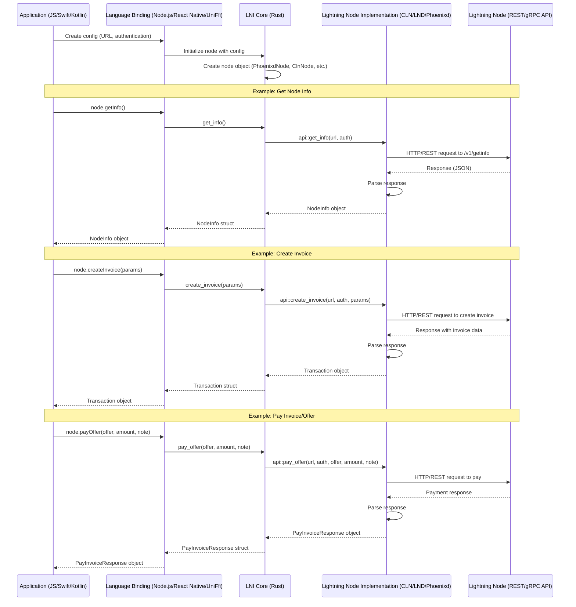

LNI Remote - Lightning Node Interface Remote
============================================

Remote connect to all the major lightning node implementations with a standard interface. 

- Supports all major nodes - CLN, LND, Phoenixd, *LNDK, (WIP) 
- Supports the main protocols - BOLT 11, BOLT 12, *LNURL and NWC
- Also popular REST apis - Strike
- Language Binding support for kotlin, swift, react-native, nodejs (typescript, javaScript). No support for WASM (yet)
- Tor support
- Runs on Android, iOS, Linux, Windows and Mac


### Interface API Examples

#### Rust
```rust
let lnd_node = LndNode::new(LndConfig { url, macaroon });
let cln_node = ClnNode::new(ClnConfig { url, rune });

let lnd_node_info = lnd_node.get_info();
let cln_node_info = cln_node.get_info();

let invoice_params = CreateInvoiceParams {
    invoice_type: InvoiceType::Bolt11,
    amount_msats: Some(2000),
    description: Some("your memo"),
    expiry: Some(1743355716),
    ..Default::default()
});

let lnd_invoice = lnd_node.create_invoice(invoice_params).await;
let cln_invoice = cln_node.create_invoice(invoice_params).await;

let pay_invoice_params = PayInvoiceParams{
    invoice: "{lnbc1***}", // BOLT 11 payment request
    fee_limit_percentage: Some(1.0), // 1% fee limit
    allow_self_payment: Some(true), // This setting works with LND, but is simply ignored for CLN etc...
    ..Default::default(),
});

let lnd_pay_invoice = lnd_node.pay_invoice(pay_invoice_params);
let cln_pay_invoice = cln_node.pay_invoice(pay_invoice_params);

let lnd_invoice_status = lnd_node.lookup_invoice("{PAYMENT_HASH}");
let cln_invoice_status = cln_node.lookup_invoice("{PAYMENT_HASH}");

let list_txn_params = ListTransactionsParams {
    from: 0,
    limit: 10,
    payment_hash: None, // Optionally pass in the payment hash, or None to search all
};

let lnd_txns = lnd_node.list_transactions(list_txn_params).await;
let cln_txns = cln_node.list_transactions(list_txn_params).await;

// See the tests for more examples
// LND - https://github.com/lightning-node-interface/lni/blob/master/crates/lni/lnd/lib.rs#L96
// CLN - https://github.com/lightning-node-interface/lni/blob/master/crates/lni/cln/lib.rs#L113
// Phoenixd - https://github.com/lightning-node-interface/lni/blob/master/crates/lni/phoenixd/lib.rs#L100
```

#### Typescript
```typescript
const lndNode = new LndNode({ url, macaroon });
const clnNode = new ClnNode({ url, rune });

const lndNodeInfo = lndNode.getInfo();
const clnNodeInfo = clnNode.getInfo();

const invoiceParams = {
    invoiceType: InvoiceType.Bolt11,
    amountMsats: 2000,
    description: "your memo",
    expiry: 1743355716,
});

const lndInvoice = await lndNode.createInvoice(invoiceParams);
const clnInvoice = await clnNode.createInvoice(invoiceParams);

const payInvoiceParams = {
    invoice: "{lnbc1***}", // BOLT 11 payment request
    feeLimitPercentage: 1, // 1% fee limit
    allowSelfPayment: true, // This setting works with LND, but is simply ignored for CLN etc...
});

const lndPayInvoice = await lndNode.payInvoice(payInvoiceParams);
const clnPayInvoice = await clnNode.payInvoice(payInvoiceParams);

const lndInvoiceStatus = await lndNode.lookupInvoice("{PAYMENT_HASH}");
const clnInvoiceStatus = await clnNode.lookupInvoice("{PAYMENT_HASH}");

const listTxnParams = {
    from: 0,
    limit: 10,
    payment_hash: None, // Optionally pass in the payment hash, or None to search all
};

const lndTxns = await lndNode.listTransactions(listTxnParams);
const clnTxns = await clnNode.listTransactions(listTxnParams);
```


#### Payments
```rust
// BOLT 11
node.create_invoice(CreateInvoiceParams) -> Result<Transaction, ApiError>
node.pay_invoice(PayInvoiceParams) -> Result<PayInvoiceResponse, ApiError>

// BOLT 12
node.get_offer(search: Option<String>) -> Result<PayCode, ApiError> // return the first offer or by search id
node.pay_offer(offer: String, amount_msats: i64, payer_note: Option<String>) -> Result<PayInvoiceResponse, ApiError> 
node.list_offers(search: Option<String>) -> Result<Vec<PayCode>, ApiError>

// Lookup
node.decode(str: String) -> Result<String, ApiError> 
node.lookup_invoice(payment_hash: String) -> Result<Transaction, ApiError>
node.list_transactions(ListTransactionsParams) -> Result<Transaction, ApiError>
```

#### Node Management
```rust
node.get_info() -> Result<NodeInfo, ApiError> // returns NodeInfo and balances
```

#### Channel Management
```rust
// TODO - Not implemented
node.channel_info()
```

#### Event Polling

LNI does some simple event polling over http to get some basic invoice status events. 
Polling is used instead of a heavier grpc/pubsub (for now) to make sure the lib runs cross platform and stays lightweight.

Typescript for react-native
```typescript
await node.onInvoiceEvents(
    // polling params
    {
        paymentHash: TEST_PAYMENT_HASH,
        pollingDelaySec: BigInt(3), // poll every 3 seconds
        maxPollingSec: BigInt(60), // for up to 60 seconds
    },
    // callbacks for each polling round
    // The polling ends if success or maxPollingSec timeout is hit
    {
        success(transaction: Transaction | undefined): void {
            console.log('Received success invoice event:', transaction);
            setResult('Success');
        },
        pending(transaction: Transaction | undefined): void {
            console.log('Received pending event:', transaction);
        },
        failure(transaction: Transaction | undefined): void {
            console.log('Received failure event:', transaction);
        },
    }
);
```

Typescript for nodejs
```typescript
await node.onInvoiceEvents(
    // polling params
    {
        paymentHash: process.env.LND_TEST_PAYMENT_HASH,
        pollingDelaySec: 4,
        maxPollingSec: 60,
    }, 
    // callback for each polling round
    // The polling ends if success or maxPollingSec timeout is hit
    (status, tx) => {
        console.log("Invoice event:", status, tx);
    }
);
```

Rust
```rust
struct OnInvoiceEventCallback {}
impl crate::types::OnInvoiceEventCallback for OnInvoiceEventCallback {
    fn success(&self, transaction: Option<Transaction>) {
        println!("success");
    }
    fn pending(&self, transaction: Option<Transaction>) {
        println!("pending");
    }
    fn failure(&self, transaction: Option<Transaction>) {
        println!("epic fail");
    }
}
let params = crate::types::OnInvoiceEventParams {
    payment_hash: TEST_PAYMENT_HASH.to_string(),
    polling_delay_sec: 3,
    max_polling_sec: 60,
};
let callback = OnInvoiceEventCallback {};
NODE.on_invoice_events(params, Box::new(callback));
```


Build
=======
```
cd crates/lni
cargo clean
cargo build
cargo test
```

Folder Structure
================
```
lni
├── bindings
│   ├── lni_nodejs
│   ├── lni_react_native
├── crates
│   ├── lni
│       |─── lnd
│       |─── cln
│       |─── phoenixd
```

Example
========
#### react-native
```sh
cd bindings/lni_react_native
cat example/src/App.tsx 
yarn start
```

`*troubleshooting react-natve`: 
- if you get an error like `uniffiEnsureInitialized`, then you might need to kill the app and restart. (ios simulator - double tap home button then swipe away app)
- try updating the pods for ios `cd example/ios && pod install --repo-update && cd ../`
- for ios open the xcode app - lni/bindings/lni_react_native/example/ios/LniExample.xcworkspace
    - Then click the project in the left "LniExample" to select for the context menu
    - In the top click "Product -> Clean build folder" and then build and run
- Lastly uninstalling the app from the mobile device

#### nodejs 
```sh
cd bindings/lni_nodejs
cat main.mjs
yarn
# then open ../../crates/lni/Cargo.toml and comment out #crate-type = ["staticlib"]
yarn build
node main.mjs
```

#### .env
```sh
TEST_RECEIVER_OFFER=lnotestoffer***
PHOENIX_MOBILE_OFFER=lnotestoffer***

PHOENIXD_URL=http://localhost:9740
PHOENIXD_PASSWORD=YOUR_HTTP_PASSWORD
PHOENIXD_TEST_PAYMENT_HASH=YOUR_TEST_PAYMENT_HASH

CLN_URL=http://localhost:3010
CLN_RUNE=YOUR_RUNE
CLN_TEST_PAYMENT_HASH=YOUR_HASH
CLN_OFER=lnotestoffer***

LND_URL=
LND_MACAROON=
LND_TEST_PAYMENT_HASH=
LND_TEST_PAYMENT_REQUEST=

NWC_URI=""
NWC_TEST_PAYMENT_HASH=""
NWC_TEST_PAYMENT_REQUEST=""

STRIKE_API_KEY=""
STRIKE_TEST_PAYMENT_HASH=""
STRIKE_TEST_PAYMENT_REQUEST=""

BLINK_API_KEY=""
BLINK_TEST_PAYMENT_HASH=""
BLINK_TEST_PAYMENT_REQUEST=""
```

Language Bindings
=================

- #### nodejs 
    - napi_rs
    - https://napi.rs/docs/introduction/simple-package
    - `cd bindings/lni_nodejs && cargo clean && cargo build --release && yarn && yarn build`
    - test `node main.mjs`

- #### nodejs - native modules (electron, vercel etc..)
    - if you want to use the native node module (maybe for an electron app) you can reference the file `bindings/lni_nodejs/lni_js.${platform}-${arch}.node`. It would look something like in your project:
        ```typescript
        const path = require("path");
        const os = require("os");
        const platform = os.platform();
        const arch = os.arch();
        const nativeModulePath = path.join(
        __dirname,
        `../../code/lni/bindings/lni_nodejs/lni_js.${platform}-${arch}.node`
        );
        const { PhoenixdNode } = require(nativeModulePath);
        ```
- #### react-native 
    - `uniffi-bindgen-react-native` lib
    - https://jhugman.github.io/uniffi-bindgen-react-native/guides/getting-started.html
    - sample https://github.com/ianthetechie/uniffi-starter  
    - `cd bindings/lni_react_native && ./build.sh`
- #### uniffi (kotlin, swift) 
    - https://mozilla.github.io/uniffi-rs/latest/
    - Uses decorators like `#[cfg_attr(feature = "uniffi", uniffi::export)]` to foreign codegen 

Shared Foreign Language Objects
===============================
If you do not want to copy objects to the foreign language bindings we can simply use the features `napi_rs` or `uniffi`
to turn on or off language specific decorators and then implement them in their respective bindings project.

Example:
```
#[cfg(feature = "napi_rs")]
use napi_derive::napi;

#[cfg_attr(feature = "napi_rs", napi(object))]
#[cfg_attr(feature = "uniffi", derive(uniffi::Record))]
pub struct PhoenixdConfig {
    pub url: String,
    pub password: String,
}

#[cfg_attr(feature = "napi_rs", napi(object))]
#[cfg_attr(feature = "uniffi", derive(uniffi::Record))]
pub struct PhoenixdNode {
    pub url: String,
    pub password: String,
}
```

Tor
===
Use the Tor Socks5 proxy settings if you are connecting to a `.onion` hidden service. Make sure to include the `"h"` in `"socks5h://"` to resolve onion addresses properly. You can start up a Tor Socks5 proxy easily using Arti https://tpo.pages.torproject.net/core/arti/

example
```rust
LndNode::new(LndConfig {
    url: "https://YOUR_LND_ONION_ADDRESS.onion",
    macaroon: "YOUR_MACAROON",
    socks5_proxy: Some("socks5h://127.0.0.1:9150".to_string()),
    accept_invalid_certs: Some(true),
    ..Default::default()
})
```


Inspiration
==========
- https://github.com/ZeusLN/zeus/blob/master/backends/LND.ts
- https://github.com/getAlby/hub/tree/master/lnclient
- https://github.com/fedimint/fedimint/blob/master/gateway/ln-gateway/src/lightning/lnd.rs

Project Structure
==================
This project structure was inpired by this https://github.com/ianthetechie/uniffi-starter/ with the intention of 
automating the creation of `react-native-lni` https://jhugman.github.io/uniffi-bindgen-react-native/guides/getting-started.html 

LNI Sequence Diagram
==================


Todo
====
- [X] make interface
- [X] napi-rs for nodejs
- [X] uniffi bindings for Android and IOS
- [X] react-native - uniffi-bindgen-react-native
- [X] async promise architecture for bindings
- [X] Tor Socks5 fetch https://tpo.pages.torproject.net/core/arti/guides/starting-arti
- [X] Simple event polling
- [ ] HTTP retries
- [ ] implement lightning nodes
    - [X] phoenixd
    - [X] cln
    - [X] lnd
    - [ ] lndk
    - [ ] ldk_node
    - [ ] eclair
    - [ ] strike?? (BOLT 12 support, BOLT 11 blinded path support?)
    - [ ] nwc?? (AlbyHub - blinded path support?) https://github.com/rust-nostr/nostr/blob/master/crates/nwc/examples/nwc.rs
    - [ ] LNURL?


To Research
============
- [X] napi-rs https://napi.rs/docs/introduction/simple-package
- [ ] can we support more complex grpc in 
- [ ] wasm?
- [ ] Facade REST API? - Use the same api as phoenixd https://phoenix.acinq.co/server/api as a facade in front of any lightning node implementation. 
