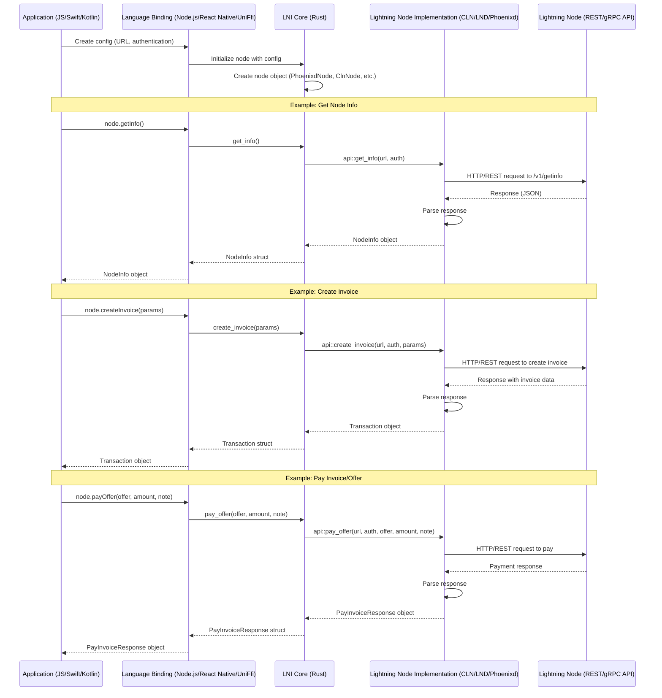

LNI - Lightning Node Interface
==============================

LNI - Lightning Node Interface. Connect to the major lightning node implementations with a standard interface. 

- Supports *CLN, *LND, *LNDK, *Phoenixd, *LNURL, *BOLT 11 and *BOLT 12 (WIP). 
- Language Binding support for kotlin, swift, react-native, nodejs (typescript, javaScript). No support for WASM (yet)
- Runs on Android, iOS, Linux, Windows and Mac


### Interface API

#### LND
```rust
let lnd_node = LndNode::new("test_macaroon".to_string(), "https://127.0.0.1:8080".to_string());
let lnd_result =  lnd_node.pay_invoice("invoice".to_string());
println!("Pay LND invoice result {}", lnd_result);
let lnd_txns = lnd_node.get_wallet_transactions("wallet_id".to_string());
lnd_txns.iter().for_each(|txn| {
    println!("LND Transaction amount: {}, date: {}, memo: {}", txn.amount(), txn.date(), txn.memo()); 
});
let lnd_macaroon = lnd_node.key();
```

#### CLN
```rust
let cln_node = ClnNode::new("test_rune".to_string(), "https://127.0.0.1:8081".to_string());
let cln_result =  cln_node.pay_invoice("invoice".to_string());
println!("Pay CLN invoice result {}", cln_result);
let cln_txns = cln_node.get_wallet_transactions("wallet_id".to_string());
cln_txns.iter().for_each(|txn| {
    println!("CLN Transaction amount: {}, date: {}, memo: {}", txn.amount(), txn.date(), txn.memo()); 
});
let cln_rune = cln_node.key();
```


#### Payments
```rust
lni.create_invoice(amount, expiration, memo, BOLT11 | BOLT12)
lni.pay_invoice()
lni.pay_offer(offer)
lni.fetch_invoice_from_offer('lno***')
lni.decode_invoice(invoice)
lni.check_invoice_status(invoice)
```

#### Node Management
```
lni.get_info()
lni.get_transactions(limit, skip)
lni.wallet_balance()
```

#### Channel Management
```
lni.fetch_channel_info()
```

#### Event Polling
```
await lni.on_invoice_events(invoice_id, (event) =>{
    console.log("Callback result:", result);
})
```


Event Polling
============
LNI does some simple event polling over https to get some basic invoice status events. 
Polling is used instead of a heavier grpc/pubsub (for now) event system to make sure the lib runs cross platform and stays lightweight. TODO websockets

Build
=======
```
cd crates/lni
cargo clean
cargo build
cargo test
```

Folder Structure
================
```
lni
├── bindings
│   ├── lni_nodejs
│   ├── lni_react_native
│   ├── lni_uniffi
├── crates
│   ├── lni
│       |─── lnd
│       |─── cln
│       |─── phoenixd
```

Example
========
react-native
```
cd bindings/lni_react_native
cat example/src/App.tsx 
yarn start
```

`*troubleshooting react-natve`: 
- if you get an error like `uniffiEnsureInitialized`, then you might need to kill the app and restart. (ios simulator - double tap home button then swipe away app)
- try updating the pods for ios `cd example/ios && pod install --repo-update && cd ../`
- for ios open the xcode app - lni/bindings/lni_react_native/example/ios/LniExample.xcworkspace
    - Then click the project in the left "LniExample" to select for the context menu
    - In the top click "Product -> Clean build folder" and then build and run
- Lastly uninstalling the app from the mobile device

nodejs 
```
cd bindings/lni_nodejs
cat main.mjs
yarn
yarn build
node main.mjs
```

### .env
```
TEST_RECEIVER_OFFER=lno**
PHOENIX_MOBILE_OFFER=lno***

PHOENIXD_URL=http://localhost:9740
PHOENIXD_PASSWORD=YOUR_HTTP_PASSWORD
PHOENIXD_TEST_PAYMENT_HASH=YOUR_TEST_PAYMENT_HASH

CLN_URL=http://localhost:3010
CLN_RUNE=YOUR_RUNE
CLN_TEST_PAYMENT_HASH=YOUR_HASH
```

Bindings
========

- nodejs 
    - napi_rs
    - https://napi.rs/docs/introduction/simple-package
    - `cd bindings/lni_nodejs && cargo clean && cargo build --release && yarn && yarn build`
    - test `node main.mjs`

- nodejs - native modules (electron, vercel etc..)
    - if you want to use the native node module (maybe for an electron app) you can reference the file `bindings/lni_nodejs/lni_js.${platform}-${arch}.node`. It would look something like in your project:
        ```typescript
        const path = require("path");
        const os = require("os");
        const platform = os.platform();
        const arch = os.arch();
        const nativeModulePath = path.join(
        __dirname,
        `../../code/lni/bindings/lni_nodejs/lni_js.${platform}-${arch}.node`
        );
        const { PhoenixdNode } = require(nativeModulePath);
        ```

- react-native 
    - uniffi-bindgen-react-native 
    - https://jhugman.github.io/uniffi-bindgen-react-native/guides/getting-started.html
    - sample https://github.com/ianthetechie/uniffi-starter  
    - `cd bindings/lni_react_native` && ./build.sh
- uniffi (kotlin, swift) 
    - https://mozilla.github.io/uniffi-rs/latest/
    - `cd bindings/lni_uniffi && cargo build`

Shared Binding Objects
====================
If you do not want to copy objects to the foreign language bindings we can simply use the features `napi_rs` or `uniffi_rs`
to turn on or off language specific decorators and then implement them in their respective bindings project.

Example:
```
#[cfg(feature = "napi_rs")]
use napi_derive::napi;

#[cfg_attr(feature = "napi_rs", napi(object))]
#[cfg_attr(feature = "uniffi_rs", derive(uniffi::Record))]
pub struct PhoenixdConfig {
    pub url: String,
    pub password: String,
}

#[cfg_attr(feature = "napi_rs", napi(object))]
#[cfg_attr(feature = "uniffi_rs", derive(uniffi::Record))]
pub struct PhoenixdNode {
    pub url: String,
    pub password: String,
}
```

Tor
===
Use Tor socks if connecting to a .onion hidden service by passing in socks5 proxy. (TODO WIP)


Inspiration
==========
- https://github.com/ZeusLN/zeus/blob/master/backends/LND.ts
- https://github.com/getAlby/hub/tree/master/lnclient
- https://github.com/fedimint/fedimint/blob/master/gateway/ln-gateway/src/lightning/lnd.rs

Project Structure
==================
This project structure was inpired by this https://github.com/ianthetechie/uniffi-starter/ with the intention of 
automating the creation of `react-native-lni` https://jhugman.github.io/uniffi-bindgen-react-native/guides/getting-started.html 

LNI Sequence Diagram
==================


Todo
====
- [X] make interface
- [X] napi-rs for nodejs
- [X] uniffi bindings for Android and IOS
- [X] react-native - uniffi-bindgen-react-native
- [X] async promise architecture for bindings
- [ ] Tor Socks5 fetch
- [ ] implement lightning nodes
    - [X] phoenixd
    - [X] cln
    - [ ] lnd
    - [ ] lndk
    - [ ] ldk_node
    - [ ] eclair
    - [ ] strike?? (BOLT 12 support, BOLT 11 blinded path support?)
    - [ ] nwc?? (AlbyHub - blinded path support?)


To Research
============
- [X] napi-rs https://napi.rs/docs/introduction/simple-package
- [ ] can we support more complex grpc in 
- [ ] wasm
- [ ] Facade REST API? - Use the same api as phoenixd https://phoenix.acinq.co/server/api as a facade in front of any lightning node implementation. 
