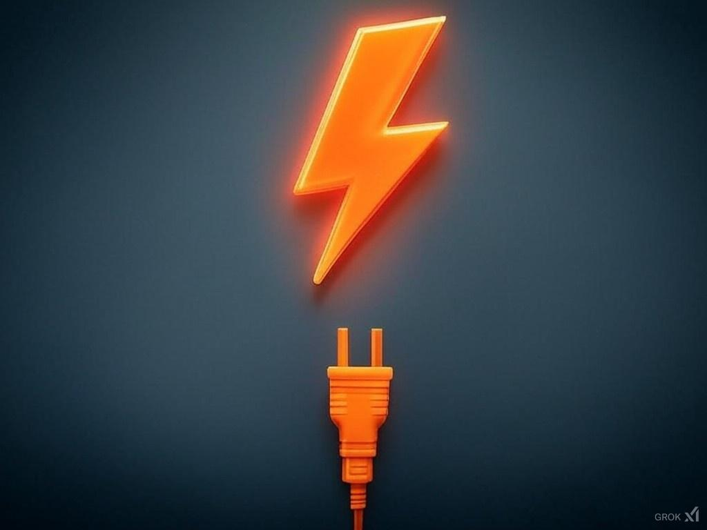

LNI - Lightning Node Interface
==============================



LNI - Lightning Node Interface. Connect to the major lightning node implementations with a standard interface. CLN, LND, LNDK, Phoenixd, LNURL (BOLT 11 and BOLT 12). Binding support for Android, IOS, React-Native, Typescript, JavaScript, Linux, Windows and Mac


Inpiration:
- https://github.com/ZeusLN/zeus/blob/master/backends/LND.ts
- https://github.com/fedimint/fedimint/blob/master/gateway/ln-gateway/src/lightning/lnd.rs

```

let lni = new lni(node: "LND" | "CLN" | "Phoenixd" | "LNURL", {
    rune: ""
    macaroon: ""
    socksUrl: ""
})

### Payments
lni.create_invoice(amount, expiration, memo, BOLT11 | BOLT12)
lni.pay_invoice()
lni.fetch_invoice_from_offer('lno***')
lni.decode_invoice(invoice)
lni.check_invoice_status(invoice)

### Node Management
lni.get_info()
lni.get_transactions(limit, skip)
lni.wallet_balance()

### Channel Management
lni.fetch_channel_info()

### Events
lni.on_payment_recievced(invoice_info)

```

Dev
====
```
cargo clean
scripts/deps.sh
scripts/build.sh
```

Tor
===
Use Tor socks if connecting to a .onion hidden service by passing in socks5 proxy.